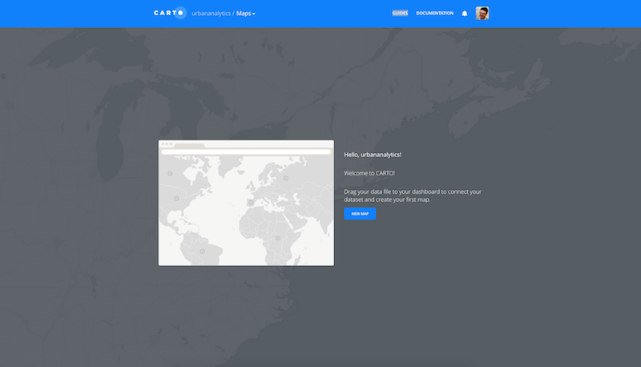
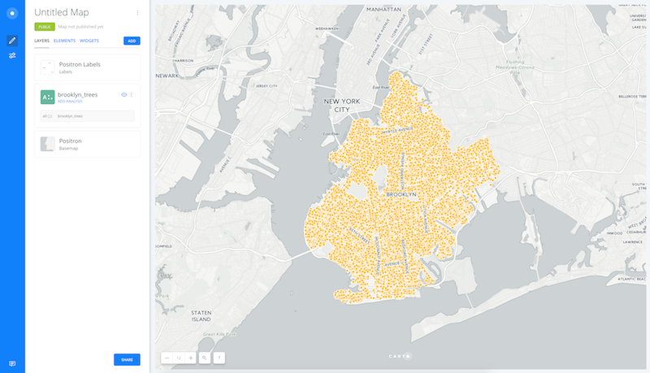

##Learning Objectives
By the end of this practical lab you will be able to:

* Understand the basics of SQL syntax to select, update and remove records from a table
* How to use SQL to create and drop tables
* Join tables of data using SQL
* Use an R interface to Carto to enable spatial queries

##SQL in R
It is most common to be running an SQL statement directly on a database, however, for this practical we will illustrate some of these basic operations in R using the sqldf package. This enables SQL statements to be run directly on data frame objects as you would with a database table. Later we will see how we can run explicitly spatial queries from within R on the [Carto](http://carto.com) platform, which presents a customized version of the spatial database [PostGIS](http://www.postgis.net/). This is not meant to be tutorial on databases, which as a topic is both complex and much wider in scope than there is room to present here, however, this practical should give some basic skills in how these resources could be queried.

In the sqldf() part of this practical we utilize three datasets, the first of these we created in the previous practical and relates to 311 calls within San Francisco, the second is a table of Workplace Area Characteristics (WAC) from the [LEHD Origin-Destination Employment Statistics (LODES)](https://lehd.ces.census.gov/data/), and finally a "crosswalk" table which provides a lookup between blocks and census tracts.

First we will read in the 311 data:

```{r}
#Read data
tract_311 <- read.csv("./data/311_Tract_Coded.csv")

#The content includes the tract code and the category of the 311 call
head(tract_311)
```

Next we will read an extract of the WAC LODES data for California. The table holds a range of variables, but of interest here are the number of workers by different types of employment. Unlike the previous data, each row (and associated ID) of relate to [blocks](https://en.wikipedia.org/wiki/Census_block) rather than tracts.

```{r}
#Read in the WAC data
WAC <- read.csv("./data/ca_wac_SI03_JT00_2014.csv")
head(WAC)
#Given the length of the block ID values R defaults to displaying these in scientific notation; however we can turn this off using the following option
options(scipen = 999)
```

The next csv we will read in is a "crosswalk" (lookup) that shows how one geography relates to another - in this case, blocks to tracts. 

```{r}
#read crosswalk (original location: https://lehd.ces.census.gov/data/lodes/LODES7/ca/ca_xwalk.csv.gz)
crosswalk <- read.csv("./data/ca_xwalk.csv")
crosswalk <- subset(crosswalk, select = c("tabblk2010","trct")) #Keep just the Block and Tract IDs
head(crosswalk)
```
Before we will begin there is a need to load a couple of required packages:

```{r eval=FALSE}
install.packages("sqldf")
```
```{r warning=FALSE, message=FALSE}
# Load library
library(sqldf)

# Load library
library(rgdal)
```
## Basic SQL Queries

The select statement returns a subset of a table and has various options:

```{r warning=FALSE, message=FALSE}
# Select all of the rows and columns in the tract_311 table - the use of * means all; essentially, duplicates the table
tmp <- sqldf('SELECT * from tract_311')

# Select only the block ID and variable that relates to jobs in "Arts, Entertainment, and Recreation (CNS17)" from the WAC data frame
AER_311 <- sqldf('SELECT w_geocode, CNS17 FROM WAC')
head(AER_311) # Shows the head of the new data frame

# Select only the block ID and variable that relates to jobs in "Arts, Entertainment, and Recreation (CNS17)" from the WAC data frame; however sort by CNS17 and in decenting order (DESC) - removing "DESC" would return the default ascending order
AER_311 <- sqldf('SELECT w_geocode, CNS17 FROM WAC ORDER BY CNS17 DESC')
head(AER_311) # Shows the head of the new data frame

# You can use an AS option to rename a variable - here CNS17 is presented as AER
AER_311 <- sqldf('SELECT w_geocode, CNS17 AS AER FROM WAC')
head(AER_311)

```

New tables were created previously using the <- syntax within R; however when using SQL within a database environment you can remove (drop) or create a table based on a select query as follows:

```
"DROP TABLE AER_311";
"CREATE TABLE AER_311 AS SELECT w_geocode, CNS17 AS AER FROM WAC";
```
In addition to selecting the columns that appear in a final result we can also use the LIMIT and WHERE option to subset the returned results to a set of rows:

```{r}
#Returns all columns but only the first 10 rows
sqldf('SELECT * from tract_311 LIMIT 10')

#Return all records where the Category is "Noise Report"
noise_311 <- sqldf('SELECT * from tract_311 WHERE Category = "Noise Report"')
```

Another useful feature of SQL is the ability to join tables. There are four main types of join statements which use the terms left and right to infer the first or second presented table within an SQL query:

| Join Type  | Description                                                                                                   |
|------------|---------------------------------------------------------------------------------------------------------------|
| Inner Join | Only those rows in both tables which match are returned                                                       |
| Left Join  | All rows in the left table, plus matching rows in the right table                                             |
| Right Join | All rows in the right table, plus matching rows in the left table                                             |
| Outer Join | All rows in both tables, matching and non matching are returned - essentially combining a left and right join |

An example of a left join is shown below - this uses "AS A" AND "AS B" after selecting the table; these are call alias and can be used in replacement for the table names. The resulting table now has the "trct" column appended.

```{r}
# Left Join
AER_311_Tract <- sqldf("SELECT * from AER_311 AS A LEFT JOIN crosswalk AS B on A.w_geocode = B.tabblk2010") 
#Show the top six rows of the table
head(AER_311_Tract)
```

### Aggregating data in SQL

We can now adapt this query so in addition to the join, we can also aggregate the data by Census Tract - summing the instance of the AER variable. This  requires the use of a "GROUP BY" statement, then an aggregate function - in this case sum(). In the select part of the statement we also now only call two columns - the AER counts from the AER_311 table, then the ID from the crosswalk table. You will see that the sum is wrapped around "A.AER" as there will be multiple rows of data for each census tract.

```{r}
# Left Join and group by
AER_311_Tract <- sqldf("SELECT sum(A.AER) AS AER, B.trct from AER_311 AS A LEFT JOIN crosswalk AS B on A.w_geocode = B.tabblk2010 GROUP BY trct") 
#Show the top six rows of the table
head(AER_311_Tract)
```

We now have created a tract level count of the number of workers in "Arts, Entertainment, and Recreation" (AER) jobs. We will now aggregate the "noise_311" table that we created earlier using the count() function. Each row in this table is a separate incidence, however the records also have the tract that they occurred in appended.

```{r}
#Group by with count
noise_311_tract <- sqldf("SELECT GEOID10, count(Category) as Noise_C FROM noise_311 GROUP BY GEOID10")
```

We can now merge the number of workers in "Arts, Entertainment, and Recreation" and those recorded noise complaints.

```{r}
# Merge the two tables
noise_AER_tract <- merge(AER_311_Tract,noise_311_tract, by.x="trct",by.y = "GEOID10")
```


## Spatial Queries
Spatially enabled databases allow queries to be run that are explicitly spatial; for example, what is the shortest path between two locations or which points lie within a polygon. Such queries are equivalent to those you might run in a standard GIS or as were demonstrated in R during the practical "Data Manipulation in R". However, typically, the volume of data that can be queried efficiently is usually larger within a database. There are many different spatial databases, however one of the most popular open source database is [PostGIS](http://www.postgis.net/). Although it is possible to download and set this up locally and use with R (see the [postGIStools package](https://github.com/SESYNC-ci/postGIStools)), we will adopt a different approach here.

The company [Carto](https://carto.com) provide a web front end to postGIS and through the package "cartodb-r" the functionality of postGIS can be utilized within R. The other advantage of this approach is that it is very scalable to large data as the Carto system exists within the cloud.

### Carto Signup and Initialisation Process

You will first need to create a Carto account by visiting: [carto.com/signup/](https://carto.com/signup/). You will be greeted with a welcome page:



At this point it might be worth having a look at the [Carto](https://carto.com/learn/guides) guides which give a practical overview of the service.

We will now import our data into Carto - drag the "Brooklyn_Trees.geojson" file onto the dashboard window to import the data. This is an extract of a full tree [inventory for NYC](https://data.cityofnewyork.us/Environment/Adopt-a-Tree-Inventory/sg2s-hjt6). Once the upload has completed you will be redirected to the Carto Builder interface - this can then be used to create a web map and dashboard interface. 



You will see on the left hand side that the dataset has been added as a layer called "brooklyn_trees".

However, we will now add a further dataset "Brooklyn_Neigh_Tab.geojson" which delineates [neighborhoods in Brooklyn](https://data.cityofnewyork.us/City-Government/Neighborhood-Tabulation-Areas/cpf4-rkhq). To upload this file,  click the blue "Add" button from the left hand side, then select "Connect Dataset" from the add a new layer window that opens. Then you can browse and add this additional layer. This will then take you back to the map view, upload and then display the file. The layer is called "brooklyn_neigh_tab" and can be seen on the left hand side. Repeat this process for the "subway.geojson" [^1] and "subway_stations.geojson"[^2].

[^1]: Sourced from: https://wfs.gc.cuny.edu/SRomalewski/MTA_GISdata/June2010_update/nyctsubwayroutes_100627.zip
[^2]: Sourced from: https://nycopendata.socrata.com/Transportation/Subway-Stations/arq3-7z49

You can look at the imported data on the Carto interface:


We will now install two required packages and a fork of the CartoDB package which has had a number of bug fixes. 

```{r eval=FALSE}
#Download required packages
install.packages("RCurl")
install.packages("RJSONIO")
install.packages("devtools")

# Devtools enables packages to be loaded from github
library(devtools)

# Install CatoDB package
install_github("alexsingleton/cartodb-r", subdir = "CartoDB")
```
```{r warning=FALSE, message=FALSE}
# Load package
library(CartoDB)
```

Although optional, if you can acquire an API key, this also enables R to *write* to Carto. Without an API, the connection can be established, but you will only be able to *read* data.

Firstly visit your account [configuration page](https://urbananalytics.carto.com/your_apps) (replace "urbananalytics" with your username) and select API keys from the menu on the left. If you have not done this before you will need to click on the blue "discover" button to enable this functionality. You then need to click on "Develop location apps with Engine", and select the "Non Commercial" option (assuming that you are doing this for a non commercial purpose!). You will then need to request an API by email from Carto.

You can connect to Carto using the cartodb() statement which requires your account name, and also an optional API key which enables you to write results to Carto.
<a id="API"></a>
```{r warning=FALSE, eval=FALSE}
# Connects R to Carto
#cartodb("urbananalytics", api.key="optional-key-for-writes") #optional API key
# Connect to your Carto instance - change the name in the "" to your account name
cartodb("urbananalytics")
cartodb.test()

```

```{r echo=FALSE, warning=FALSE, message=FALSE}
cartodb("urbananalytics", api.key="5c0dcfdd79366035bf50cc6229da08032b35445a")
```


### Returning Tabular and Spatial Objects

Now that we have connected to Carto, we can pull data down into R using the cartodb.collection() function. We will first extract ten rows of the "brooklyn_trees" table (as the total size of this table is very large). We will 

```{r}
# 
#Download the top ten rows of the table "brooklyn_trees"
tmp <- cartodb.collection("brooklyn_trees", geomAs="XY", limit=10)
tmp
```

Data stored within a spatial database typically has an additional column which in the case of Carto (and PostGIS) is named by default as "the_geom". This stores the spatial information that is applicable to each row of the database. In the case of the table "brooklyn_trees", this is the latitude and longitude coordinates of each tree record; and in "brooklyn_neigh_tab", is a set of [linestrings](https://en.wikipedia.org/wiki/Well-known_text) delineating the polygons bounding each of the neighborhood zones. The addition of the geomAS="XY" converted these to latitude and longitude in the results of the returned query.

It is also possible to use SQL directly on the Carto table:

```{r}
tmp

#Same query, but supplied as a formal SQL query
tmp <- cartodb.collection(sql="SELECT cartodb_id, the_geom, tree_speci, serial FROM brooklyn_trees LIMIT 10")
tmp
```

You will have seen that the_geom was returned directly, however, we can also use PostGIS functions to convert this into different formats -  [ST_AsText()](http://www.postgis.org/docs/ST_AsText.html) as a [Well Known Text](https://en.wikipedia.org/wiki/Well-known_text) format; or [ST_X()](http://postgis.net/docs/manual-2.2/ST_X.html) and [ST_Y()](http://postgis.net/docs/ST_Y.html) to return the longitude and latitude. You will see that AS is also used again to give the new columns a name.

```{r}
tmp

#Same query, but supplied as a formal SQL query
tmp <- cartodb.collection(sql="SELECT cartodb_id,  ST_AsText(the_geom), ST_X(the_geom) AS Lon, ST_Y(the_geom) AS Lat, tree_speci, serial FROM brooklyn_trees LIMIT 10")
tmp
```

Although it is useful to return attributes of the data stored on Carto as tables, it is also possible to return these as spatial data by adding a 'method="GeoJSON"' option. If you are using this with an SQL statement as above, an error will be returned unless you also have "the_geom" as part of the SELECT statement (not wrapped in a function - e.g. ST_AsText).

This example creates a new object called "zones" which contains GeoJSON boundaries that were read from the "brooklyn_neigh_tab" table. Note that the function also specified which attributes from the table to include.


```{r}
#Get the GeoJSON
zones <- cartodb.collection("brooklyn_neigh_tab",columns=c("cartodb_id","the_geom"),method="GeoJSON")
#Create a SpatialPolygonsDataFrame obect
zones.SP <-readOGR(zones,layer = 'OGRGeoJSON',verbose =FALSE) #The "verbose = FALSE" stops readOGR printing the content of the geoJSON to the R console
#Plot the zones
plot(zones.SP)
```


## Basic Spatial Analysis using Carto

As discussed earlier, PostGIS provides the underlying technology for Carto and there is a huge array of spatial analysis functionality. These cover a wide array of analysis and data types, with their specification detailed fully in the [PostGIS documentation](http://postgis.net/docs/). We will however illustrate a number of the common features here.

### Area Calculation
```{r}
# Return the areas of polygons
test<- cartodb.collection(sql="SELECT cartodb_id, ntaname, ST_Area(the_geom::geography) / 1000000 AS Area_KM FROM brooklyn_neigh_tab")
```

In the above query we have added "::geography" after "the_geom" to return the area calculation in meters, which we then divide by 1000000 (one square KM - 1000 * 1000) to give the result in kilometers (KM).

### Centroid of an Object
```{r}
#Return the centroid of the polygons
test <- cartodb.collection(sql="SELECT cartodb_id, ntaname, ST_Centroid(the_geom) as the_geom FROM brooklyn_neigh_tab",method="GeoJSON")

# Plot the results
plot(readOGR(test,layer = 'OGRGeoJSON',verbose =FALSE))
```
Here we used the [ST_Centroid()](http://postgis.refractions.net/docs/ST_Centroid.html) function to calculate the centroid locations from the zones, and returned this as "the_geom". As demonstrated before, the results can be returned as GeoJSON and then read into R with readOGR().

### Buffers
```{r}
#Return buffers
buffers <- cartodb.collection(sql="SELECT cartodb_id,  ST_Buffer(the_geom::geography,200) as the_geom FROM brooklyn_trees WHERE tree_speci = 'Green Ash'",method="GeoJSON")

# Plot the results
buffers.SP <- readOGR(buffers,layer = 'OGRGeoJSON',verbose =FALSE)
#Plot first 100 tree buffers
plot(buffers.SP[1:100,])

```
This SQL uses the [ST_Buffer()](http://www.postgis.org/docs/ST_Buffer.html) function to return the buffers (as polygons). The "::geography" option is used again, and as such, the number specified within the function is in meters. The buffer set is therefore 200 meters, and the results are limited to just those trees with a species type of "Green Ash".

### Intersections

Two tables not yet used include the location of subway lines and stations in NYC. These extend beyond the boundary of Brooklyn so we will demonstrate here how these data can be limited to these extents within Carto. First we will use the [ST_Intersects()](http://postgis.org/docs/ST_Intersects.html) function to extract the stations within Brooklyn:

```{r}
# Return intersection of stations with Brooklyn neighborhoods
intersection_stations <- cartodb.collection(sql="SELECT a.*,b.ntaname FROM subway_stations AS a, brooklyn_neigh_tab AS b WHERE ST_Intersects(a.the_geom, b.the_geom)",method="GeoJSON") # b.ntaname is added to the select statement to append the neighbouhood names that the stations are located within

# Plot the results
intersection_stations.SP <- readOGR(intersection_stations,layer = 'OGRGeoJSON',verbose =FALSE)
plot(intersection_stations.SP)

#We can also see how each of the stations now have the neighborhood appended
head(intersection_stations.SP@data)
```

In the above SQL, you will see the use of "AS a" and "AS b" in relation to the tables - these are alias which means you don't have to refer to the full table in the function "ST_Intersects(a.the_geom, b.the_geom)". This could be written fully as "ST_Intersects(subway_stations.the_geom, subway_stations.the_geom)".

We will now also write the results of this query back to Carto using "CREATE TABLE subway_stations_brooklyn AS", however this will only work if the [API key was set earlier](#API):
<a id="newtab"></a>
```{r}
# Write the query to Carto
cartodb.collection(sql="CREATE TABLE subway_stations_brooklyn AS SELECT a.* FROM subway_stations AS a, brooklyn_neigh_tab AS b WHERE ST_Intersects(a.the_geom, b.the_geom)")

# In order to make the table visible on the datasets page, this statement is also required
cartodb.collection(sql="select cdb_cartodbfytable('subway_stations_brooklyn')")

```

If you visit your [datasets](https://urbananalytics.carto.com/dashboard/datasets) page you should now see the table "subway_stations_brooklyn" listed.


Here is another example of using ST_Intersects() for the line geometry:

```{r}
# Return intersection of stations with Brooklyn neighborhoods
intersection_lines <- cartodb.collection(sql="SELECT a.* FROM subway a, brooklyn_neigh_tab b WHERE ST_Intersects(a.the_geom, b.the_geom)",method="GeoJSON")

# Plot the results
intersection_lines.SP <- readOGR(intersection_lines,layer = 'OGRGeoJSON',verbose =FALSE)
plot(intersection_lines.SP)
```
You can see how the extents have been cut out of the full network as follows - the selected lines are in red:

```{r echo=FALSE}

# Return intersection of stations with Brooklyn neighborhoods
lines <- cartodb.collection(sql="SELECT * FROM subway",method="GeoJSON")

# Plot the results
lines.SP <- readOGR(lines,layer = 'OGRGeoJSON',verbose =FALSE)
plot(lines.SP)
plot(zones.SP, col="#24478f4D", border = NA, add=TRUE)
plot(intersection_lines.SP,col="red", add=TRUE)
```

### Calculating distances between objects

[Earlier](#newtab) we created a new table containing the geometry for the subway stations in Brooklyn. We will now use the ST_Distance() function to calculate the distance from a latitude and longitude location (Carto offices in Brooklyn) to the subway stations.

Here we can calculate the distance to the subway entrances from a new geometry that we create using [ST_Point()](http://postgis.net/docs/ST_Point.html), which is assigned the [projection](https://en.wikipedia.org/wiki/Map_projection) WGS84 (i.e. SRID 4326) using the ST_SetSRID() function.

```{r}

distance_station <- cartodb.collection(sql="SELECT name, ST_Distance(the_geom::geography, ST_SetSRID(ST_Point(-73.9365832, 40.7042924),4326)::geography) as distance FROM subway_stations_brooklyn ORDER BY distance")

#Show the closest six subway stations
head(distance_station)
```

# Further resources / training
* [Carto Map Academy](https://carto.com/academy/) - An excellent site including tutorials and assignments
* [SQL Tutorial](http://www.w3schools.com/sql/) - A detailed set of SQL examples for most common functionality